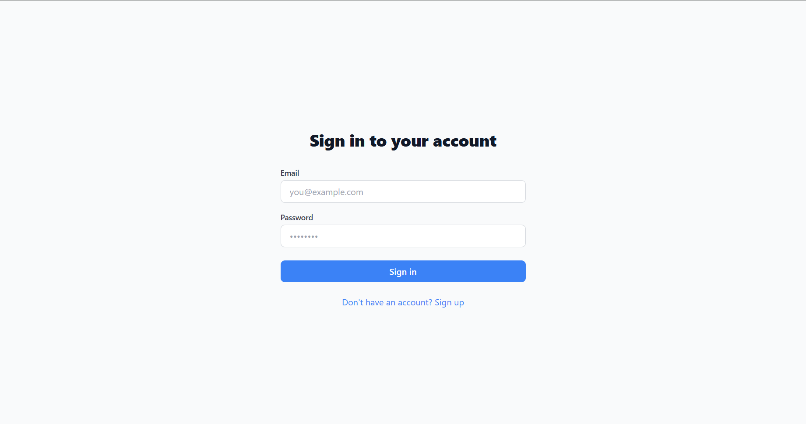
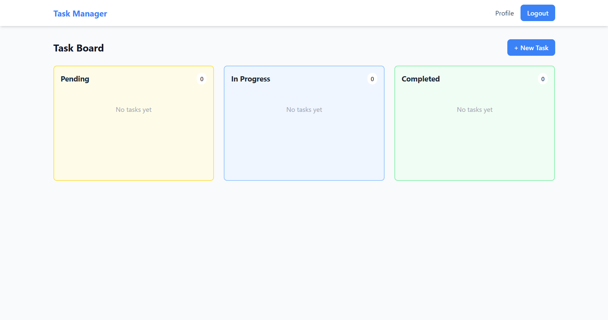
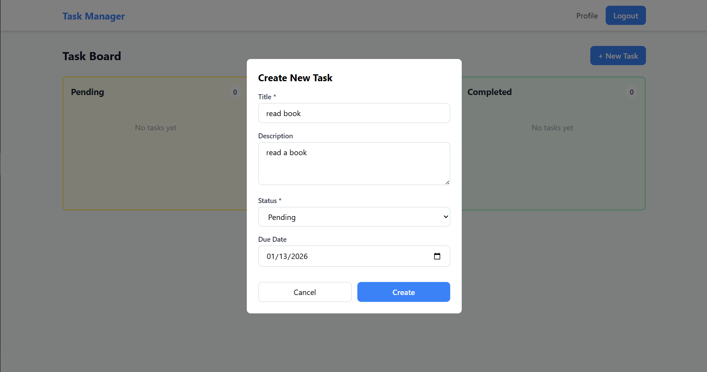
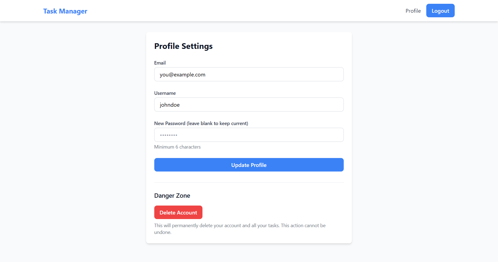

# Task Management System

A full-stack web application for managing tasks with a Kanban board interface. Built with FastAPI and React.

## Features

- User authentication (signup/login/logout)
- Create, read, update, and delete tasks
- Kanban board with drag-and-drop functionality
- Three task statuses: Pending, In Progress, Completed
- User profile management
- Mobile responsive design
- JWT-based authentication
- RESTful API

## Tech Stack

### Backend
- FastAPI - Python web framework
- SQLAlchemy - Database ORM
- SQLite - Database
- JWT - Authentication
- Pydantic - Data validation

### Frontend
- React 18 - UI framework
- Vite - Build tool
- Tailwind CSS - Styling
- @dnd-kit - Drag and drop
- Axios - API client
- React Router - Navigation

## Project Structure

```
task-management-system/
├── backend/              # FastAPI backend
│   ├── app/
│   │   ├── routers/      # API routes
│   │   ├── models.py     # Database models
│   │   ├── schemas.py    # Pydantic schemas
│   │   ├── auth.py       # Authentication logic
│   │   └── main.py       # FastAPI app
│   ├── requirements.txt
│   └── README.md
│
├── frontend/             # React frontend
│   ├── src/
│   │   ├── components/   # React components
│   │   ├── pages/        # Page components
│   │   ├── services/     # API services
│   │   └── utils/        # Helper functions
│   ├── package.json
│   └── README.md
│
└── README.md
```

## Getting Started

### Prerequisites

- Python 3.8+
- Node.js 16+
- npm or yarn

### Backend Setup

1. Navigate to backend directory:
```bash
cd backend
```

2. Create virtual environment:
```bash
python -m venv venv
source venv/bin/activate  # Windows: venv\Scripts\activate
```

3. Install dependencies:
```bash
pip install -r requirements.txt
```

4. Setup environment variables:
```bash
cp .env.example .env
```

Edit `.env` and set your SECRET_KEY (important for production).

5. Run the server:
```bash
uvicorn app.main:app --reload
```

Backend runs at `http://localhost:8000`

API docs available at `http://localhost:8000/docs`

### Frontend Setup

1. Navigate to frontend directory:
```bash
cd frontend
```

2. Install dependencies:
```bash
npm install
```

3. Start development server:
```bash
npm run dev
```

Frontend runs at `http://localhost:5173`

## Usage

1. Open `http://localhost:5173` in your browser
2. Sign up with email, username, and password
3. Create tasks using the "New Task" button
4. Drag tasks between columns to change their status
5. Click "Edit" on a task to modify it
6. Click "Delete" to remove a task
7. Go to Profile to update your account details

## API Endpoints

### Authentication
- `POST /auth/signup` - Register new user
- `POST /auth/login` - Login user

### Users
- `GET /users/me` - Get current user
- `PUT /users/me` - Update user profile
- `DELETE /users/me` - Delete account

### Tasks
- `GET /tasks` - Get all tasks (optional ?status= filter)
- `POST /tasks` - Create task
- `GET /tasks/{id}` - Get single task
- `PUT /tasks/{id}` - Update task
- `PATCH /tasks/{id}` - Partial update
- `DELETE /tasks/{id}` - Delete task

All task endpoints require authentication via Bearer token.

## Database Schema

**Users Table:**
- id (Primary Key)
- email (Unique)
- username (Unique)
- hashed_password
- created_at

**Tasks Table:**
- id (Primary Key)
- title
- description
- status (pending/in-progress/completed)
- due_date
- created_at
- user_id (Foreign Key → Users)

## Security

- Passwords hashed with bcrypt
- JWT tokens with expiration
- Protected API routes
- CORS configured
- Input validation on all endpoints
- SQL injection prevention via ORM

## Error Handling

The API returns standard HTTP status codes:
- 200: Success
- 201: Created
- 204: No Content
- 400: Bad Request
- 401: Unauthorized
- 404: Not Found
- 500: Internal Server Error

All errors include a JSON response with error details.

## Development

The project uses incremental commits to show development progress:
- Initial setup and project structure
- Database models and schemas
- Authentication implementation
- Task CRUD operations
- Frontend components
- Drag and drop functionality
- Profile management
- Error handling and validation

## Screenshots

### Login Page


### Kanban Board


### Create Task


### Profile Management


## Live Demo

- **Frontend:** https://alextoppo-btech1031922.vercel.app
- **Backend API Docs:** https://alextoppo-btech1031922.onrender.com/docs

### Test Credentials

For testing purposes, you can use:
- **Email:** you@example.com
- **Password:** johndoe

Or feel free to create your own account!

## License

This project is open source and available for educational purposes.